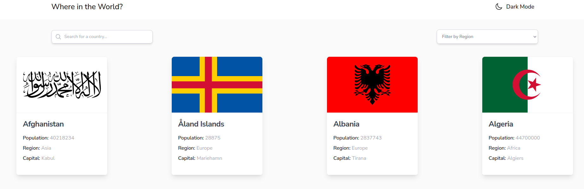
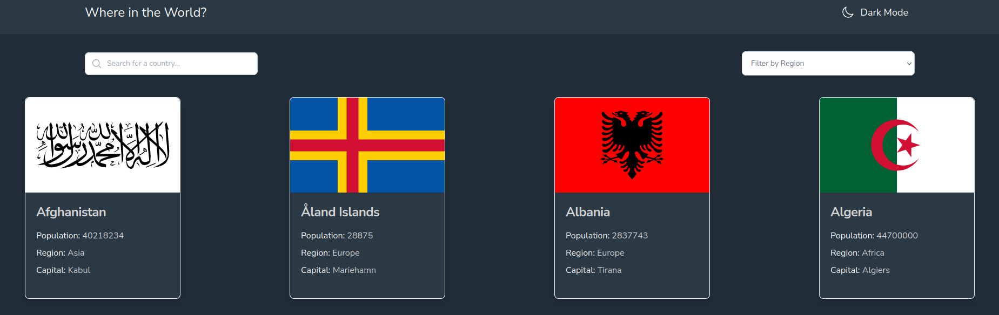
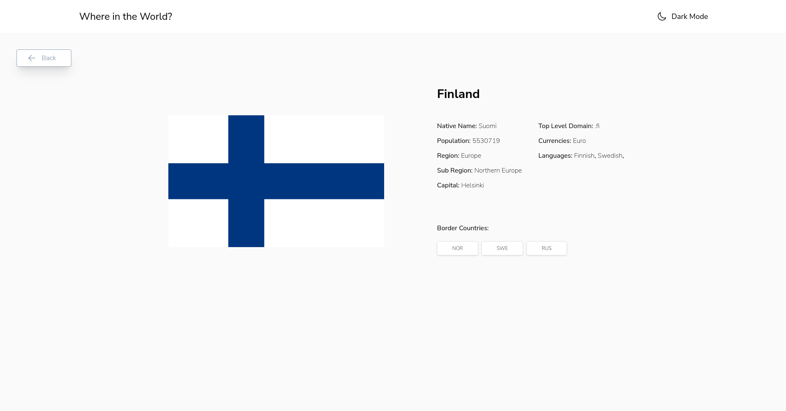
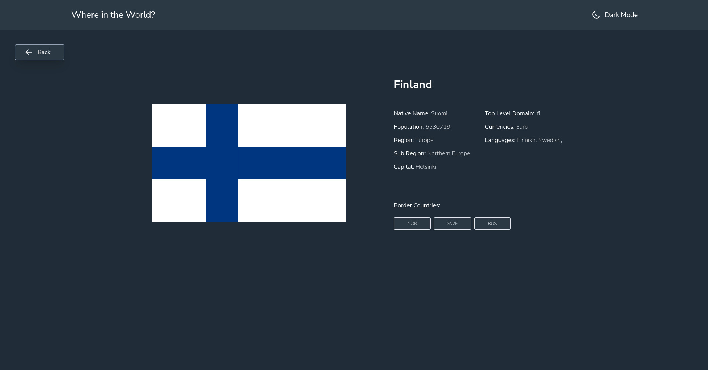

I can use any JavaScript framework/library on the front-end, such as React or Vue. I also have complete control over which packages you use to make HTTP requests or style mine project.

My users should be able to:

  - See all countries from the API on the homepage
  - Search for a country using an input field
  - Filter countries by region
  - Click on a country to see more detailed information on a separate page
  - Click through to the border countries on the detail page
  - Toggle the color scheme between light and dark mode (optional)
    
## Built With

- Tailwind CSS
- React
- Redux Toolkit
- Axios
- React Router

## Full Screen View

